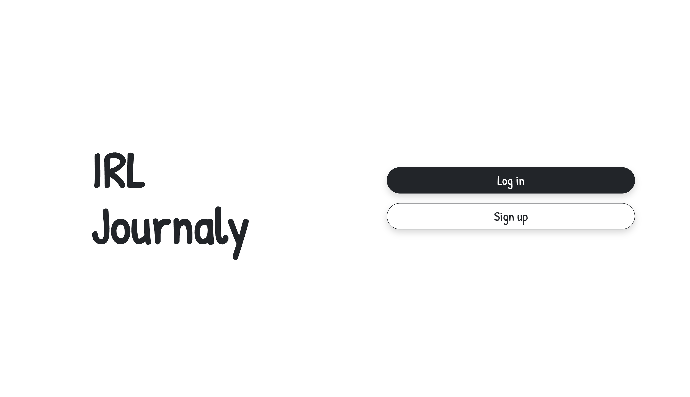
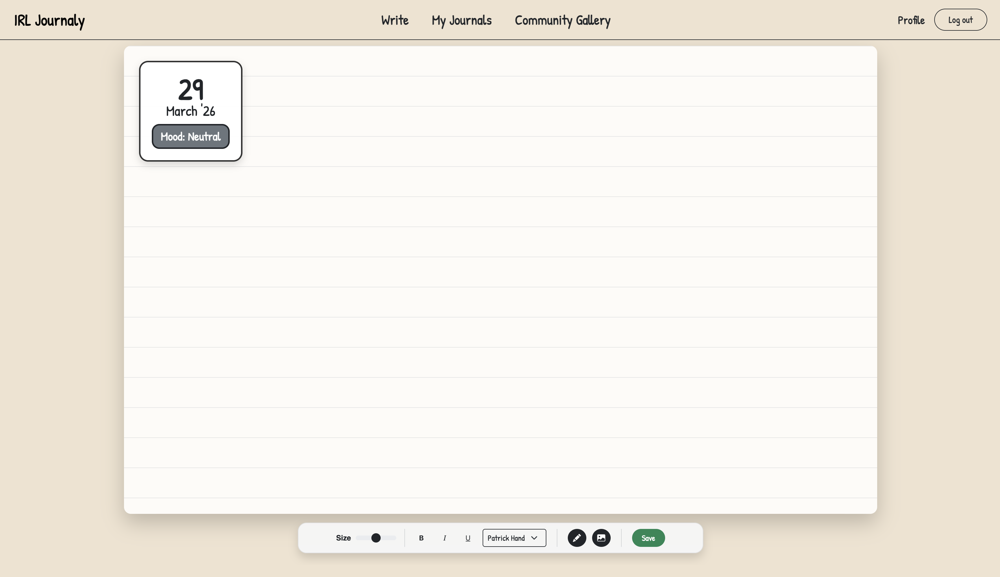
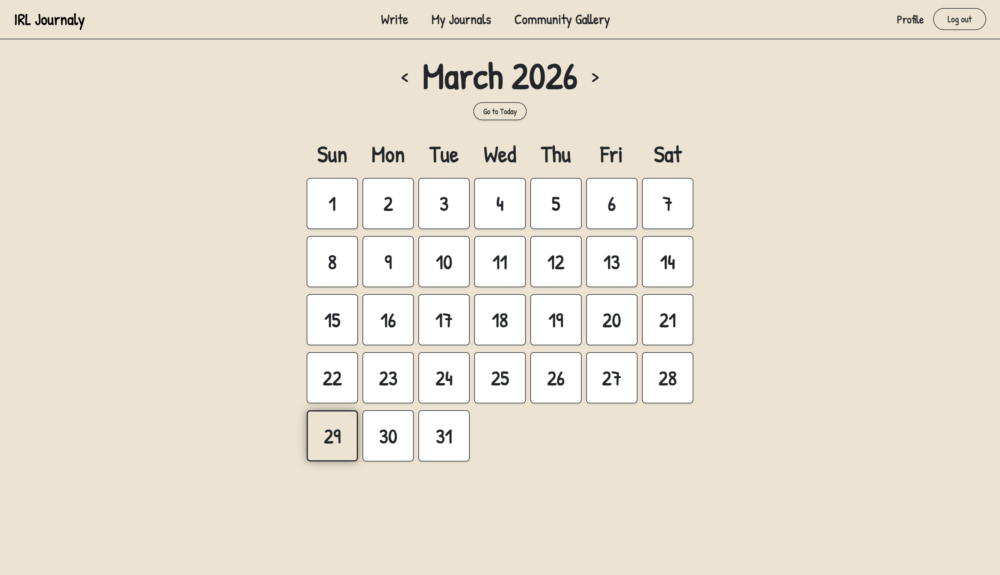
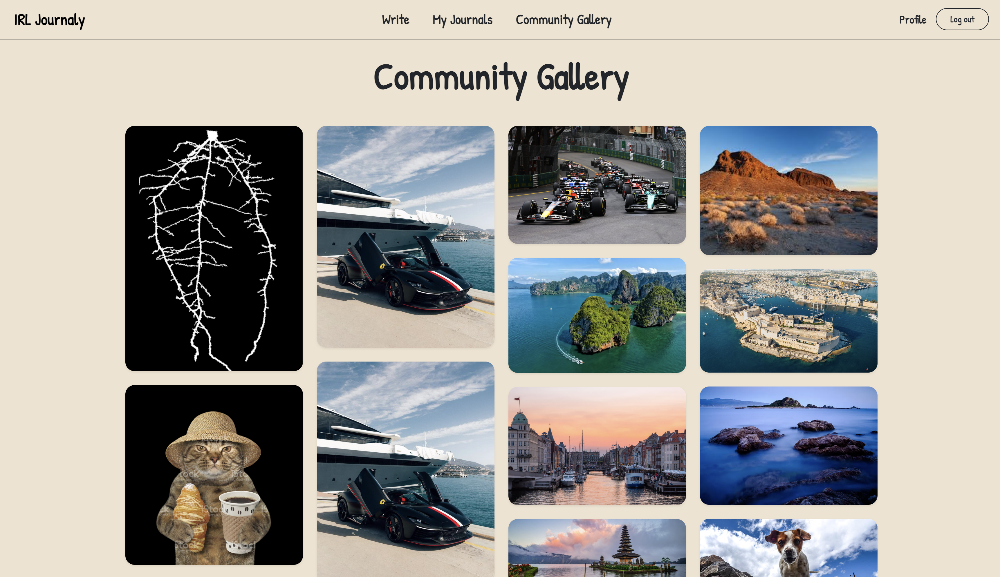

# IRL Journaly

Welcome to IRL Journaly! This is my graduate project for solirius reply that uses Ruby on Rails, 3D Gaussian Splatting (ml-sharp) and AI text processing (Groq). 










Follow the instructions below to get your local development environment set up.

## Prerequisites
* Ruby (v3.1.2 or higher recommended)
* PostgreSQL
* Python 3.11+ (for `ml-sharp`)

---

## 1. Download / Clone the Repository

First, clone this repository to your local machine and navigate into the project folder:

```bash
cd Desktop
git clone https://github.com/jes4l/irljournaly.git
cd irljournaly
```

## 2. Set up ML-Sharp (3D Gaussian Splatting)

IRL Journaly relies on Apple's `ml-sharp` to convert 2D images into 3D Gaussian Splats. You can check out their official repository here for more details and documentation: [Apple ML-Sharp on GitHub](https://github.com/apple/ml-sharp).

You need to download it and set up a Python virtual environment to run it locally alongside the Rails app.

1. **Clone the `ml-sharp` repository** somewhere on your computer (e.g., your Desktop):
   ```bash
   cd Desktop
   git clone https://github.com/apple/ml-sharp.git
   cd ml-sharp
   ```

2. **Create the input and output folders** (useful for testing the model manually):
   ```bash
   mkdir input_images
   mkdir output_gaussians
   ```

3. **Create and activate a Python virtual environment** (Make sure you name it `.venv`!):
   If you are using `conda`:
   ```bash
   conda create -n sharp_env python=3.11
   conda activate sharp_env
   # Or using standard python venv:
   python3 -m venv .venv
   source .venv/bin/activate
   ```

4. **Install the dependencies** required by `ml-sharp`:
   ```bash
   pip install -e .
   ```

## 3. Update the ML-Sharp Path in Rails

You need to tell the Rails application where you downloaded `ml-sharp`. 

1. Open `irljournaly/app/jobs/generate_splat_job.rb` in your code editor.
2. Find the following line (around line 26):
   ```ruby
   ml_sharp_path = "/Users/jesal.vadgama/Desktop/ml-sharp"
   ```
3. **Change this path** to the exact absolute path where you cloned `ml-sharp` in Step 2.

## 4. Get Your API Keys & App Passwords

To use the AI transcription and email features, you need to generate a couple of keys.

### Groq API Key (For AI Transcripts)
1. Go to the [GroqCloud Console](https://console.groq.com/keys).
2. Create an account or log in.
3. Click **"Create API Key"**, give it a name, and copy the generated key.

### Google App Password (For Email Sending)
Because standard Gmail passwords don't work for SMTP servers, you need an App Password.
1. Go to your [Google Account Security Settings](https://myaccount.google.com/security).
2. Ensure **2-Step Verification** is turned on.
3. Search for **"App Passwords"** in the settings search bar (or go to 2-Step Verification -> App Passwords).
4. Create a new App Password and name it your website name (e.g., `jesal.wiki`).
5. Copy the 16-character password generated.

## 5. Set up your `.env` File

In the root folder of your `irljournaly` Rails project, create a new file called `.env` and add the keys you just generated:

```env
# .env

GROQ_API_KEY=your_groq_api_key_here
GMAIL_USERNAME=your_email@gmail.com
GMAIL_APP_PASSWORD=your_16_character_app_password_here
```

## 6. Install Dependencies and Run

Now that everything is configured, install the Ruby dependencies and set up your database.

1. **Install the gems:**
   ```bash
   bundle install
   ```

2. **Prepare the database:**
   ```bash
   bin/rails db:prepare
   ```

3. **Start the application:**
   IRL Journaly uses a custom host script to boot up the Rails Server, Solid Queue (for background jobs), and Cloudflare Tunnels simultaneously.
   ```bash
   ./bin/host
   ```
   *(Note: If you are not using Cloudflare Tunnels, you can just start the server normally with `bin/rails s` and run `bin/jobs` in a separate terminal).*

Visit `http://localhost:3000` (or your tunnel URL) in your browser, and you're good to go!

## 7. Next Steps (Planned Features)

Here are some of the upcoming features planned to make IRL Journaly even better:

* **Daily Journaling Reminders:** A notification system (via email or web push) to gently remind you if you haven't logged an entry for the day.
* **Interactive Doodle Canvas:** A built-in drawing tool that lets you sketch and doodle directly onto your journal pages alongside your text and 3D models.
* **Strict Splat Validation:** Update the Gaussian Splatting background job to strictly accept only valid image files, preventing accidental processing of unsupported formats.
* **Media Support:** Expand the journal canvas to accept and seamlessly play all file types, including audio files, videos, and GIFs.
* **Custom Audio Override:** Add an option to replace the AI-generated Text-to-Speech (TTS) transcript audio with your own uploaded voice memos and recordings.